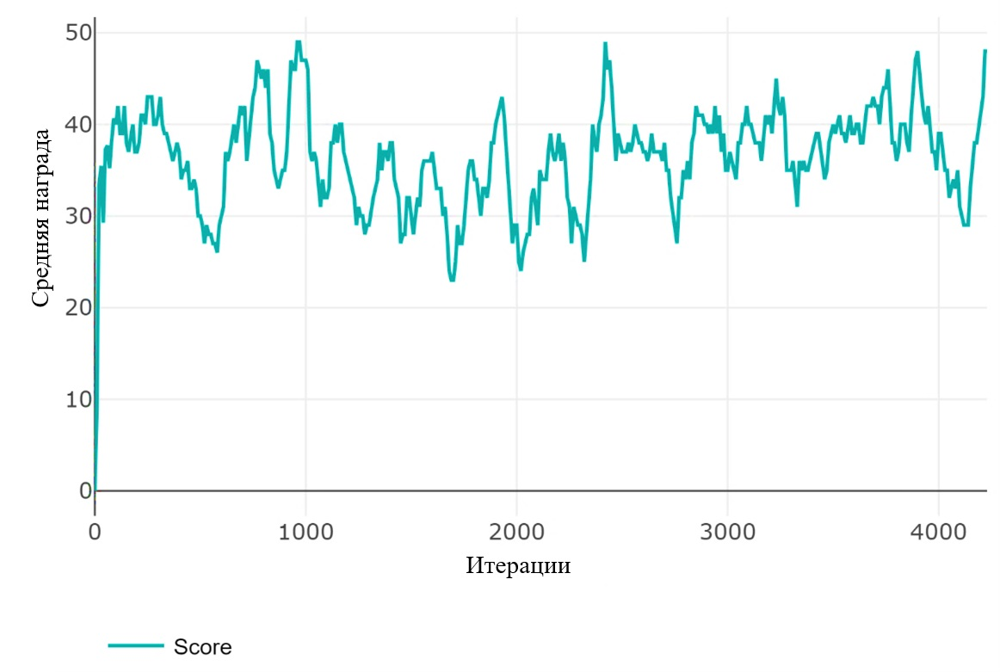
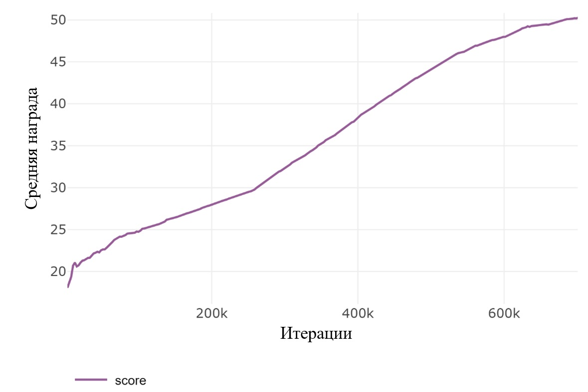
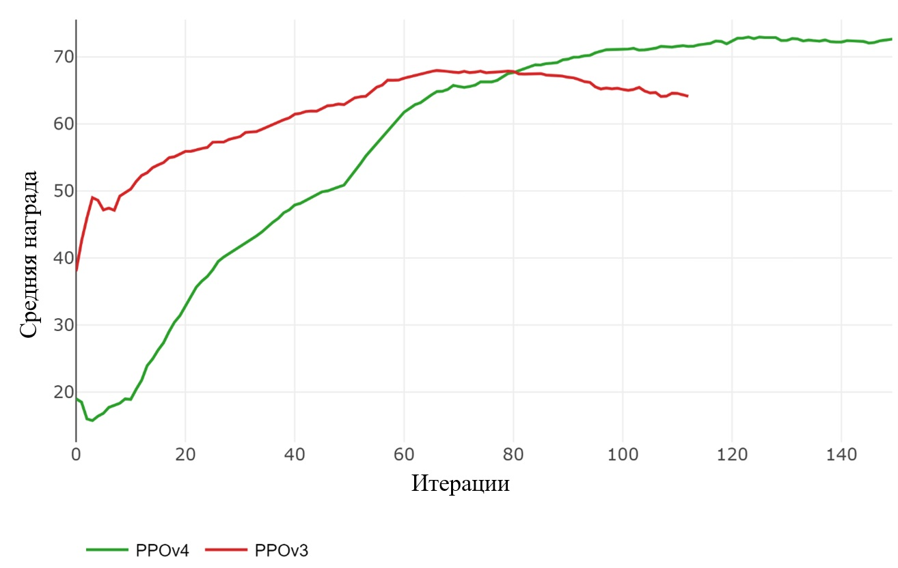

# PyBulletProject: Обучение с подкреплением для манипуляции роботами

**Обучение интеллектуальных агентов для задач манипуляции роботами с использованием PyBullet (ВКР Магистра)**

Этот репозиторий содержит реализации алгоритмов обучения с подкреплением для обучения интеллектуальных агентов задачам манипуляции роботом-манипулятором в виртуальной среде KukaDiverseObjectEnv с использованием PyBullet. Проект фокусируется на достижении высокой точности и координации в задачах робототехники, сравнивая и улучшая методы обучения с подкреплением.

---

## 📚 Оглавление

- [Описание](#description)
- [Реализованные алгоритмы](#algorithms)
- [Требования](#requirements)
- [Установка](#installation)
- [Использование](#usage)
- [Структура репозитория](#structure)
- [Демонстрация](#demonstration)
- [Производительность](#performance)
- [Ссылки](#references)

---

## 📖 Описание <a name="description"></a>

Этот проект исследует применение алгоритмов обучения с подкреплением (RL) для обучения интеллектуальных агентов задачам манипуляции роботами в виртуальных средах. Используя библиотеку PyBullet для физического моделирования, проект оценивает и сравнивает два основных алгоритма RL — Deep Q-Network (DQN) и Proximal Policy Optimization (PPO) — вместе с несколькими улучшенными версиями PPO (PPOV1, PPOV2, PPOV3, PPOV4). Эти варианты включают такие улучшения, как параллельная обработка, оптимизация скорости обучения и механизмы внимания для повышения эффективности обучения и точности задач.

<div style="text-align: center;">
  
  <p text-align="center">Демонстрация работы алгоритмов RL в среде KukaDiverseObjectEnv с использованием PyBullet.</p>
</div>

Цель проекта — решение задач, требующих высокой точности и координации при взаимодействии роботов с объектами, демонстрируя, как RL может быть эффективно применен в робототехнике.


**!Реализация DQN была удалена!**

---

## 🛠️ Реализованные алгоритмы <a name="algorithms"></a>

- **Deep Q-Network (DQN)**:
  - Модельно-независимый алгоритм RL, использующий нейронную сеть для аппроксимации Q-функции.
  - Подходит для дискретных пространств действий и служит базовой линией для сравнения.

- **Proximal Policy Optimization (PPO)**:
  - Метод градиента политики, выполняющий несколько эпох стохастического градиентного восхождения на суррогатной целевой функции.
  - Известен своей стабильностью и эффективностью в задачах непрерывного управления.

- **Варианты PPO**:
  - **PPOV1**: Адаптированная реализация PPO.
  - **PPOV2**: Вводит синхронное параллельное выполнение действий в среде, используя многопроцессорность для ускорения сбора данных и обучения.
  - **PPOV3**: Оптимизирует алгоритм за счет уменьшения размеров пакетов и увеличения скорости обучения, сокращая время обучения.
  - **PPOV4**: Добавляет механизм внимания для фокусировки на релевантных частях входных данных, что критически важно для точных задач манипуляции.


---

## 🎯 Требования <a name="requirements"></a>

- Python 3.10+
- Библиотеки (из `requirements.txt` или устанавливаются вручную):
  - `torch`
  - `pybullet`
  - `gym`
  - `numpy`
  - `matplotlib`
  - `pillow`
  - `tensorboardX`
  - `clearml`

---

## 📥 Установка <a name="installation"></a>

```bash
# Клонируем репозиторий
git clone https://github.com/CaphAlderamin/PyBulletProject.git
cd PyBulletProject

# Создаем виртуальное окружение conda
conda create -n pybulletenv python=3.10 -y
conda activate pybulletenv

# Устанавливаем зависимости
pip install -r requirements.txt
```

---

## 💻 Использование <a name="usage"></a>

1. Для обучения агента PPO:
   ```bash
   python ppo_train.py
   ```

1. Для тестирования агента PPO:
   ```bash
   python ppo_test.py
   ```

---

## 📂 Структура репозитория <a name="structure"></a>

```
PyBulletProject/
├── demo/                           # Демонстрация работы
├── actor_critic_model.py
├── arguments_continuous_action.py
├── model_run.py
├── parallel_envs_creation.py
├── ppo_test.py
├── ppo_train.py
├── README.md
└── requirements.txt

```

---

## 🎥 Топологии нейронных сетей <a name="demonstration"></a>

<div style="text-align: center;">
  
  <p text-align="center">Топология нейронной сети агента DQN</p>
</div>

<div style="text-align: center;">
  
  <p text-align="center">Топология нейронной сети агента PPO</p>
</div>

<div style="text-align: center;">
  
  <p text-align="center">Топология нейронной сети агента PPOV1</p>
</div>

<div style="text-align: center;">
  
  <p text-align="center">Топология нейронной сети агента PPOV3</p>
</div>

<div style="text-align: center;">
  
  <p text-align="center">Топология нейронной сети агента PPOV4</p>
</div>
---

## 📊 Производительность <a name="performance"></a>

Проект сравнивает производительность различных алгоритмов RL и их вариантов по средним наградам за 100 эпизодов. 

<div align="center">
  <table>
    <tr>
      <td align="center">
        
      </td>
      <td align="center">
        
      </td>
    </tr>
  </table>
  <p>Средняя награда агента DQN (а), средняя награда агента PPO (б)</p>
</div>

---

<table>
  <tr>
    <td align="center">
      
      <p>Средняя награда агентов PPOv1, PPOv2, PPOv3</p>
    </td>
    <td align="center">
      
      <p>Средняя награда агентов PPOv3 и PPOv4</p>
    </td>
  </tr>
</table>


## 🗒️ Результаты тестирования <a name="test-results"></a>
| Агент | Средняя награда | Шаги обучения | Время обучения (ч:мм:сс)|
|-------|-----------------|---------------|-------------------------|
| DQN   | 51,000 | 4239       | 2:06:54,878 |
| PPO   | 50,202 | 696320     | 5:12:04,500 |
| PPOv1 | 50,690 | 65 (66560) | 1:52:07,842 |
| PPOv2 | 50,061 | 26 (26624) | 0:35:12,836 |
| PPOv3 | 50,067 | 13 (13312) | 0:09:34,629 |
| PPOv4 | 50,229 | 47 (48128) | 0:32:01,375 |

Результаты тестирования показывают, что:
- Стандартные DQN и PPO могут решать поставленные задачи, но требуют значительных вычислительных ресурсов.
- Варианты PPO (PPOV1, PPOV2, PPOV3, PPOV4) значительно сокращают время обучения, сохраняя или улучшая производительность.
- PPOV4 с механизмом внимания достигает наивысших средних наград и наиболее быстрой сходимости.

| Алгоритм | Описание улучшений | Преимущества |
|----------|--------------------|--------------|
| DQN      | Базовый алгоритм с Q-функцией | Подходит для дискретных действий |
| PPO      | Стабильный метод градиента политики | Эффективен для непрерывного управления |
| PPOV1    | Оптимизация под среду | Увеличивает набор данных |
| PPOV2    | Параллельная обработка | Ускоряет сбор данных |
| PPOV3    | Уменьшенные пакеты, быстрая сходимость | Сокращает время обучения |
| PPOV4    | Механизм внимания | Повышает точность манипуляции |
---

## 📚 Ссылки <a name="references"></a>

- [Залогин Н.Е., Григорьев Д.С. (2024). *Об обучении интеллектуальных агентов в виртуальной среде для задачи управления роботом-манипулятором*. Известия Томского политехнического университета, Индустриальная кибернетика, 2(3).](https://doi.org/10.18799/29495407/2024/3/61)